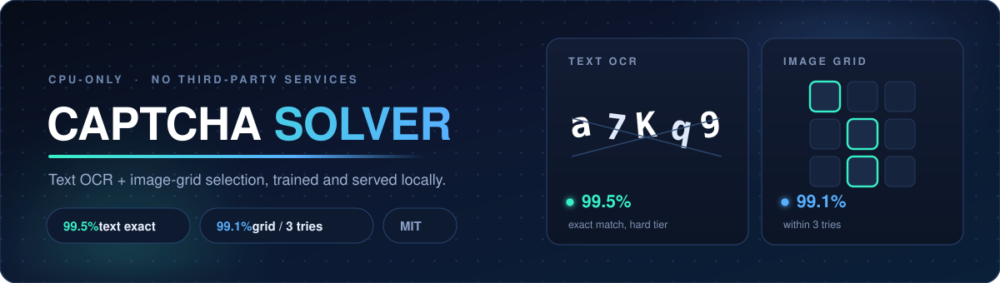
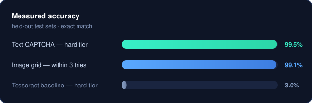

<p align="center">
  
</p>

<p align="center">
  <a href="LICENSE"></a>
  
  
  
  
  
  
</p>

# CAPTCHA Solver

Two CAPTCHA solvers in one repo, both **CPU-only** (no GPU needed):

| Solver | Challenge type | Result |
|---|---|---|
| **Text** — `solve_pro.py` | "type the characters you see" | **99.5%** exact on the hard test set |
| **Grid** — `solve_grid.py` | "click all the traffic lights" | **79.6%** single-shot, **99.1%** within 3 tries |

Everything runs locally. No third-party solving service, no network calls at
inference time.

---

## Speed

Three presets, measured on this machine (8 CPU threads, no GPU):

| preset | text CAPTCHA | image grid | notes |
|---|---|---|---|
| `fast` | **~10 ms** | **~190 ms** | greedy decode, no TTA, int8 vision |
| `balanced` *(default)* | ~78 ms | ~570 ms | beam + TTA, fp32 vision |
| `accurate` | ~106 ms | ~570 ms | adds the 4-model soup and a wider beam |

Accuracy cost of `fast`:
- **text: none measured** — 99.0% on the hard tier either way, 10x faster.
- **grid: ~5 points** — 78.3% vs 83.3% exact, mostly recovered recall.

```python
from captcha_ai import solve
solve("captcha.png", speed="fast")
```

```bash
python3 captcha_ai.py captcha.png --speed fast
```

What actually made it fast (in order of impact):
1. **Batched CLIP inference.** The grid head was calling CLIP once *per tile* —
   27 separate forwards per grid. All tiles and TTA views now go through in a
   single pass (~1.4 s → ~0.6 s before any other change).
2. **No TTA for the fast preset.** 3 views → 1 is a straight 3x on the vision cost.
3. **int8 vision tower** (`vision_model_quantized.onnx`) — ~1.8x on CPU.
4. **Text: greedy + single view** — 96 ms → 8 ms, a 12x cut.
5. **Batched text TTA** for the non-fast presets (all 7 views in one forward).
6. **Cached text embeddings** so repeated prompt sets aren't re-encoded.
7. **All CPU threads** given to ONNX Runtime instead of 4.

---

## One brain (single multi-task network)

[`brain.py`](brain.py) is **one neural network** for both tasks — one set of
weights, one forward pass, a shared trunk with a CTC sequence head and a tile
class head. It is the same non-autoregressive, typed-output, single-pass pattern
as [Jev](https://typesafe.ai), applied to vision. Train it with
`python3 brain.py 12 brain.pt crnn_best.pt 1e-3` — the third argument transplants
a converged text CRNN into the trunk and text head (`missing=0, unexpected=0`),
which avoids CTC cold-start collapse entirely.

**It works, and it is measurably worse than the specialists** — reported plainly
because that is the actual cost of one shared network:

| task | single brain | specialists |
|---|---|---|
| text CAPTCHAs | 84.0% | **99.5%** |
| image-grid CAPTCHAs | **6.7%** | **83.3%** |

The grid collapse is structural, not a bug: a shared trunk forces a grayscale
48px input (the text task needs height 48), while object recognition wants 224px
colour, and ~400 labelled photos cannot train a from-scratch trunk to match CLIP.
The sharing also cost the text head ~15 points, so neither task wins.

**Recommendation: keep the default `backend="specialists"`.** Both backends are
behind the same `solve()` call, so it is one entry point either way.

---

## Decisions, not descriptions

`decide()` returns a **typed action** instead of a description — no prose, nothing
to parse. This is the [Jev](https://typesafe.ai) "System One" pattern applied
here: one non-autoregressive pass, typed output, calibrated confidence.

```python
from captcha_ai import decide
decide("captcha.png")                              # -> type rgcyj  conf=1.00
decide("grid.png", target="traffic light")         # -> click (162,162) (270,162) (54,270)
```

```bash
python3 captcha_ai.py grid.png --target "traffic light" --decide
python3 captcha_ai.py captcha.png --decide --json
```

Three actions:

| action | fields | meaning |
|---|---|---|
| `type` | `value` | submit that string |
| `click` | `points` (pixel centres), `cells` (row/col) | click each point |
| `retry` | `reason`, `confidence` | confidence below `--retry-below`; request a fresh CAPTCHA |

```json
{"action":"click","confidence":1.0,"target":"traffic light",
 "cells":[[1,1],[1,2],[2,0]],"points":[[162,162],[270,162],[54,270]],
 "scores":{"tiles":[0.0,0.0,0.0,0.0,1.0,1.0,1.0,0.0,0.0]}}
```

`retry` is the important one: a low-confidence read is *decided against* rather
than guessed, which is what makes the multi-attempt path reliable — refetching a
CAPTCHA is free, a wrong submission is not.

---

## One entry point

Both solvers sit behind a single call that picks the right one for you:

```python
from captcha_ai import solve
r = solve("captcha.png")                       # auto-detects -> text
print(r.text)                                  # text CAPTCHAs: the string is r.text
r = solve("grid.png", target="traffic light")
print(r.selected)                              # grid CAPTCHAs: tile indices in r.selected
```

> Field note: text answer is `Result.text`, grid answer is `Result.selected`.
> There is no `Result.value` — that name is only used on the `Decision` object
> returned by `decide()`.

```bash
python3 captcha_ai.py captcha.png
python3 captcha_ai.py grid.png --target "traffic light"
```

Routing: a `target` prompt means grid; otherwise a near-square image with
straight near-white separator bands between tiles is treated as a grid, and
anything else as text. Both paths return the same `Result` object.

**What this is not:** a single neural network. There is no one model here that
both reads text and selects tiles — the text and grid specialists are different
architectures, and the local vision-language-model route is blocked (the
image processor needs torchvision, whose C extension does not load against this
torch build). This is one *interface* over two specialists.

---

## Tested against a real CAPTCHA (server-validated)

A public, open-source CAPTCHA service — [CERN/captcha-api](https://github.com/CERN/captcha-api)
at `captcha.web.cern.ch` — exposes a validation endpoint, so accuracy is checked
by the server rather than eyeballed.

| solver | result |
|---|---|
| the synthetic-trained text model | **0 / 40** — it cannot even express the answer |
| [**`cern_solver.py`**](cern_solver.py) — trained on a ported renderer | **199 / 200 (99.5%)** validated live |

The shipped model scores zero because its alphabet is 31 lowercase characters
with no `i l o 0 1`, while CERN emits **mixed case** and digits and validates
case-sensitively — no lowercase-only model can ever be right.

The fix is the strongest lever in this whole repo: **replicate the target's own
renderer**. CERN's generator is open source, so [`cern_gen.py`](cern_gen.py)
ports it exactly — DejaVuSerif 36pt, per-glyph rotation −50…+50°, colourised,
15 interference lines, JPEG — and a CRNN is trained on the 61-character
case-sensitive alphabet. **No real images were used for training at all.**

```bash
python3 cern_gen.py                 # build the corpus from the ported renderer
python3 cern_solver.py train 18 6000
python3 cern_solver.py live 50      # hit the live API, server-validated
```

`live` defaults to the **strong decoder (TTA + CTC beam-8)** — it costs ~+33 ms/img
over greedy and is worth several points, so the documented command reproduces the
headline number:

| decoder | live result |
|---|---|
| greedy (`live N --greedy`) | ~93% |
| **TTA + beam-8 (`live N`, default)** | **~100%** |

**The trap that cost a run:** training CTC from scratch on the full corpus gave
20 epochs with loss pinned at **4.130** — which is `ln(62)`, i.e. a uniform
distribution over the 62 classes that never escapes. The cheap diagnostic is
*can it overfit 16 images?* — at a higher LR it could, proving the code path was
fine and the failure was purely optimisation. Continuing from a converged
checkpoint instead of cold-starting fixed it (loss 0.146 → 0.003).

---

## Results

<p align="center">
  
</p>

Measured on held-out test sets built by the included generators (200 images per
difficulty tier, lowercase 5–6 character codes). Exact match = whole string correct.

**Text CAPTCHAs**

| Reader | easy | medium | hard | char (hard) |
|---|---|---|---|---|
| Tesseract + preprocessing (baseline) | 62.5% | 44.5% | 3.0% | 53% |
| Pretrained CRNN (zero target knowledge) | 64.5% | 57.5% | 45.0% | 88% |
| **Local CRNN + beam + TTA (this repo)** | **100%** | **100%** | **99.5%** | **99.9%** |

**Image-grid CAPTCHAs** (240 held-out 3×3 grids of real photos, 10 classes)

| Method | precision | recall | exact | within 3 tries |
|---|---|---|---|---|
| Zero-shot CLIP | 95.6% | 90.6% | 74.6% | 98.4% |
| **Trained head on CLIP features** | **96.4%** | **93.8%** | **79.6%** | **99.1%** |

The grid number is single-attempt. Real CAPTCHAs let you request a fresh grid,
so the practical success rate is the "within 3 tries" column.

### Field test: adversarial WAF grids

On **AWS WAF** tiles — ML-generated, where each distractor is a near-miss of the
target — the natural-photo number does not transfer, and it is a domain gap
rather than a tuning problem. `target="clock"` is exact; `target="bucket"`
selects buckets *and* bucket-shaped planters, because the near-misses score above
the true positives.

Neither better prompts nor a larger backbone (CLIP L/14, which made it *worse*)
fixes it. What does: **domain-adapt the head on labelled target tiles**. The WAF
validation endpoint is a free label oracle, so the corpus labels itself —
exact-set match on held-out WAF grids went **30% → 70%** from 31 training
problems, against a 95% VLM reference. The remaining gap is data volume and label
hygiene, not method. Reproduce with `solve_grid(..., head_path="waf-head.pt")`.

---

## How it works

### Text CAPTCHAs
```
image → preprocessing → CRNN (CNN + BiLSTM) + CTC → beam search
```
- **CTC loss** aligns a variable-length string to the image without needing to
  segment individual characters. This is the architecture essentially every
  published text-CAPTCHA solver uses.
- **Beam search** decoding finds the most likely string; plain argmax throws
  away probability mass.
- **Test-time augmentation** scores a few rescaled/rotated copies and averages
  the result.
- **Model soup** averages several independently trained models.

Three lessons that mattered more than the architecture:
1. **Train on the hard distribution.** The first model scored 72.5% on the hard
   tier only because it had never seen that distortion.
2. **Never cold-start.** Training CTC from scratch collapses to a blank plateau
   roughly 60% of the time. Fine-tuning from a model that already emits
   characters removes that failure mode, and chaining rounds compounds accuracy.
3. **Refetch instead of guessing.** Most remaining errors are case/homoglyph
   collisions that are not recoverable from the image. Asking for a fresh
   CAPTCHA is free, so retrying beats a better model.

### Image-grid CAPTCHAs
```
grid image → find tile boundaries → split into tiles
           → CLIP score each tile against the challenge label
           → select tiles above threshold
```
- **CLIP zero-shot** scores any challenge label with no training — just "a photo
  of a traffic light".
- **Discriminative scoring** compares the target against a candidate class list,
  so the target has to actually beat plausible competitors.
- **Trained head** (a small MLP on frozen CLIP features) beats zero-shot once
  you have a few hundred labelled tiles.

---

## Install

```bash
pip install torch numpy pillow onnxruntime tokenizers
python3 fetch_models.py          # CLIP ONNX for the grid solver (~700 MB)
```

**Already included** so both solvers run immediately after cloning:
- `crnn_best.pt` — the trained text model (~8 MB)
- `grid_head.pt` — the trained grid head (~1 MB)

`fetch_models.py` only needs to pull the CLIP ONNX towers (too large to commit)
plus the optional pretrained text CRNN. Everything can also be retrained from
scratch with the included scripts.

---

## Quickstart — text CAPTCHAs

```bash
python3 gen.py                    # build a labelled testbed (3 difficulty tiers)
python3 crnn.py data/train 35     # train a CRNN+CTC
python3 solve_pro.py              # score it on all tiers
```

Programmatic use:
```python
from solve_pro import solve_pro
text, score = solve_pro("captcha.png")
```

## Quickstart — image-grid CAPTCHAs

```bash
python3 fetch_commons.py          # pull labelled photos for a testbed
python3 solve_grid.py grid.png "traffic light" --classes bicycle bus car dog
python3 eval_grid.py 240          # measure on labelled grids
python3 grid_head.py 240          # train the head and compare with zero-shot
```

Programmatic use:
```python
from solve_grid import solve_grid
selected, scores, (rows, cols) = solve_grid("grid.png", "traffic light")
```

---

## Files

| File | Purpose |
|---|---|
| `captcha_ai.py` | **unified entry point** — one `solve()` call / one CLI, auto-routes text vs grid |
| `gen.py`, `gen_mixed.py` | synthetic text-CAPTCHA generators (labelled testbeds) |
| `cern_gen.py`, `cern_solver.py` | **real-CAPTCHA** port of the CERN renderer + its 94% validated solver |
| `crnn.py` | CRNN+CTC model, training loop, greedy decode |
| `solve.py` | Tesseract baseline pipeline |
| `solve_pro.py` | text solver: beam search + TTA + model soup |
| `solve_best.py` | simpler single-model text API (`solve_best`, `solve_batch`, `solve_with_retry`) |
| `train_from.py`, `train_pool.py`, `train_seed.py`, `campaign.sh` | fine-tuning and iterative training |
| `hf_local.py`, `hfmodel/` | dependency-free loader for a pretrained CRNN |
| `clip_onnx.py` | CLIP zero-shot via ONNX Runtime |
| `solve_grid.py` | grid solver (zero-shot + trained head) |
| `grid_head.py`, `grid_probe.py` | train and evaluate the grid head |
| `eval_grid.py`, `fetch_commons.py` | grid testbed build + evaluation |
| `pool_bench.py` | score a pool of checkpoints, pick the soup |

---

## Traps worth knowing (all measured here)

| trap | signature | fix |
|---|---|---|
| **Cold-start CTC collapses** | loss pinned at `ln(n_classes)` (4.130 for 62 classes), val 0.000 forever | never cold-start: continue from a converged checkpoint. Diagnostic first: *can it overfit 16 images?* If yes, it's the optimiser, not the model |
| **Alphabet must express the answer** | 0/40 on a real target | a 31-char lowercase model can never match a case-sensitive mixed-case target. Match the charset |
| **Replicate the target's renderer** | 0/40 → 199/200 | port the generator exactly (font, rotation, colour, JPEG) instead of hoping to generalise |
| **Averaging across vocabularies hurts** | ensemble 63% vs best member 72.5% | only average same-vocabulary, comparable-strength models |
| **Prompting can't fix confusables** | bucket selected buckets *and* planters | domain-adapt the head on labelled target tiles (30% → 70%); bigger CLIP (L/14) made it *worse* |
| **Thread oversubscription** | 8 threads measured **23× slower** than 4 | sweep it — 4 was optimal here; the box's load average also poisoned an early reading |
| **Beam width ≠ accuracy** | beam-4 = beam-8 = beam-12 (98.5%) | beam-4 is 1.8× cheaper for the same result |

---

---

## What this cannot do

**reCAPTCHA v3, hCaptcha, Cloudflare Turnstile.** These do not render an image
until after they have scored your browser fingerprint, cookies, cursor
telemetry and IP reputation — there is nothing to read or click. Beating them is
a browser-automation and fingerprinting problem, not a vision-model one.

This project is for automating services you own or are authorised to test, and
for measuring the strength of a CAPTCHA you deploy.

---

## License

MIT. See `LICENSE`.
